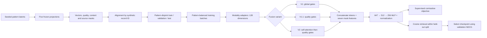

# Architecture

The experiment starts with frozen, synthetic modality vectors. It trains the fusion network; it does not train language encoders, consume raw text, or query an operational database.

| Input modality | Frozen width | Adapter hidden width | Shared token width |
| --- | ---: | ---: | ---: |
| Location | 256 | 256 | 128 |
| Time | 256 | 256 | 128 |
| Narrative | 1,024 | 256 | 128 |
| Subject attributes | 128 | 128 | 128 |
| Object attributes | 128 | 128 | 128 |

The source notebook calls the last two channels `suspect` and `weapon`; these remain technical modality keys where needed for source fidelity. All inputs are randomly generated vectors. They contain no descriptions of actual people, locations, events, or objects.

Each modality has a content mask. The two structured channels also have source masks, distinguishing an available source with no usable content from an absent source. A missing modality contributes a zero gate. An all-missing record produces a zero embedding and is excluded from training and retrieval.

V1 learns one sigmoid bias per modality. V1.1 adds one learned quality coefficient per modality: `sigmoid(w_m * q_im + b_m)`. This gate is not constrained to increase with quality. V2 first adds modality identity embeddings and uses a four-head self-attention block over the five tokens, then applies quality gates. Attention weights are diagnostics, not causal explanations or calibrated feature importance.

The five 128-dimensional tokens and seven mask values create a 647-dimensional fusion input. A 512-dimensional hidden layer projects to a normalized 256-dimensional record embedding. Cosine similarity ranks candidates, with the query itself removed.
