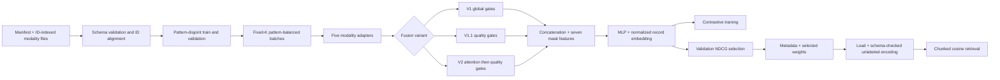

# Architecture

The package trains a fusion network on precomputed embeddings. Upstream encoders and their preprocessing are supplied by the user and remain frozen here. The original synthetic generator supplies an independent example of this input contract.

## Five-modality feature schema

The roles are fixed; widths are configurable for own-data models. Default widths preserve the source experiment:

| Role | Default input width | Default adapter hidden width | Default token width |
| --- | ---: | ---: | ---: |
| `location` | 256 | 256 | 128 |
| `time` | 256 | 256 | 128 |
| `narrative` | 1,024 | 256 | 128 |
| `suspect` (subject attributes) | 128 | 128 | 128 |
| `weapon` (object attributes) | 128 | 128 | 128 |

The schema also records encoder names/versions, input normalization, and quality definitions. New inference inputs must match this schema, even if their record IDs differ. The source's `suspect` and `weapon` names remain technical keys; included examples contain only synthetic vectors.

Each modality has a content mask. The two structured channels also have source masks, distinguishing an available source without usable content from an absent source. Missing modalities contribute zero gates/final tokens. All-missing records produce zero embeddings and are excluded from training and retrieval while remaining visible in audit counts.

## Fusion semantics

V1 learns one sigmoid bias per modality. V1.1 adds a learned coefficient for the supplied scalar quality: `sigmoid(w_m * q_im + b_m)`. Quality gates are not constrained to increase with quality. A quality value must have a documented meaning and consistent scaling at training and inference; it is not automatically a measured reliability label.

V2 adds modality identity embeddings and uses multihead self-attention over five tokens, residual normalization, and a feed-forward layer before applying quality gates. There are four heads by default. Missing tokens are masked as attention keys, with an all-missing safeguard. Quality gates act after interaction: low-quality content may influence other tokens before its own final token is gated. Attention weights are diagnostics, not causal explanations.

By default, five 128-dimensional tokens and seven mask values form a 647-dimensional input to a 512-hidden-unit MLP and a normalized 256-dimensional output. Own-data configuration can change token/hidden/output widths and attention settings without changing these semantics.

## Persistence and inference

`train` saves the validation-selected state in `best/weights.pt`, accompanied by versioned `best/metadata.json`. The metadata records architecture, feature schema, effective training settings, selection, provenance, and integrity digests. Loading reconstructs the model on CPU, loads tensor weights with `weights_only=True`, and checks the schema and state strictly. This is a selected-model bundle, not optimizer/RNG state for exact training resume.

`encode` accepts feature-only inputs and writes vectors, record IDs, availability, and model/schema identity. `retrieve` requires compatible embeddings from the same weights, computes scores in query/gallery chunks, excludes self-matches by ID, and orders equal scores by candidate ID. It retains top K candidates without allocating the full query-by-gallery score matrix. Chunking bounds score-matrix memory; the input embedding arrays still reside in memory.

`evaluate` reports within-split retrieval with relevance from pattern labels. Training/validation provenance guards against evaluating overlapping IDs, patterns, or supplied groups as held-out test data. These checks cannot discover semantic duplicates or upstream preprocessing leakage that the supplied IDs/schema do not reveal. See [own-data preparation](own-data.md).
