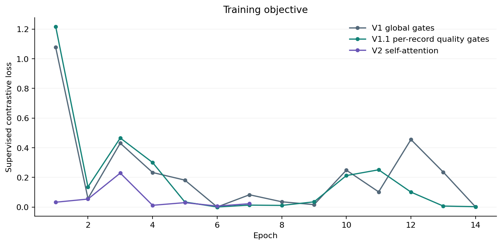
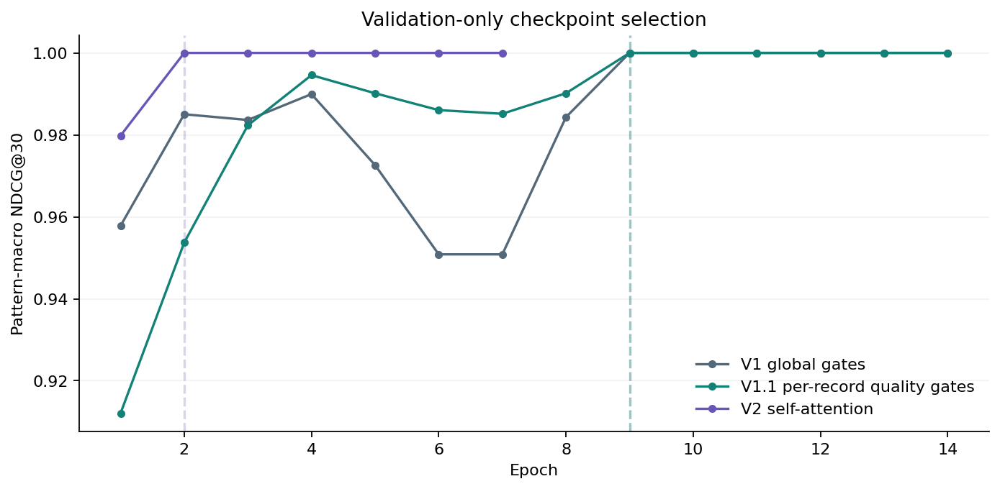
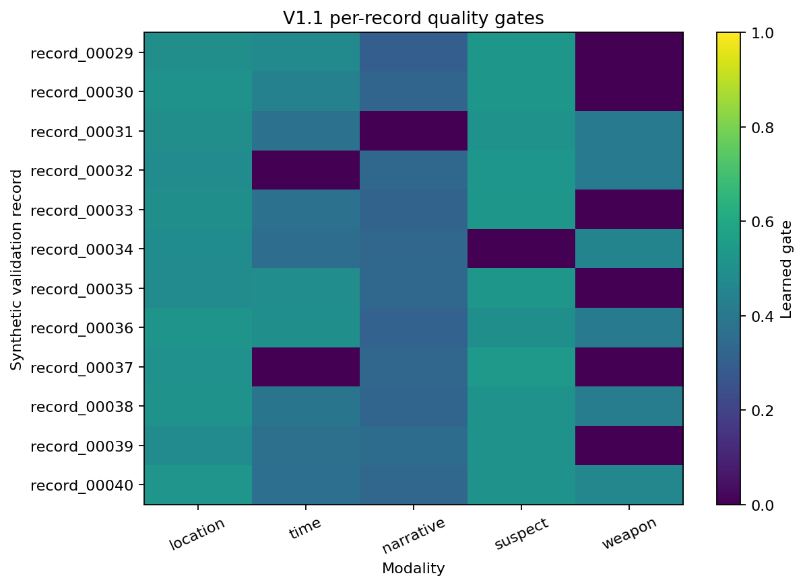
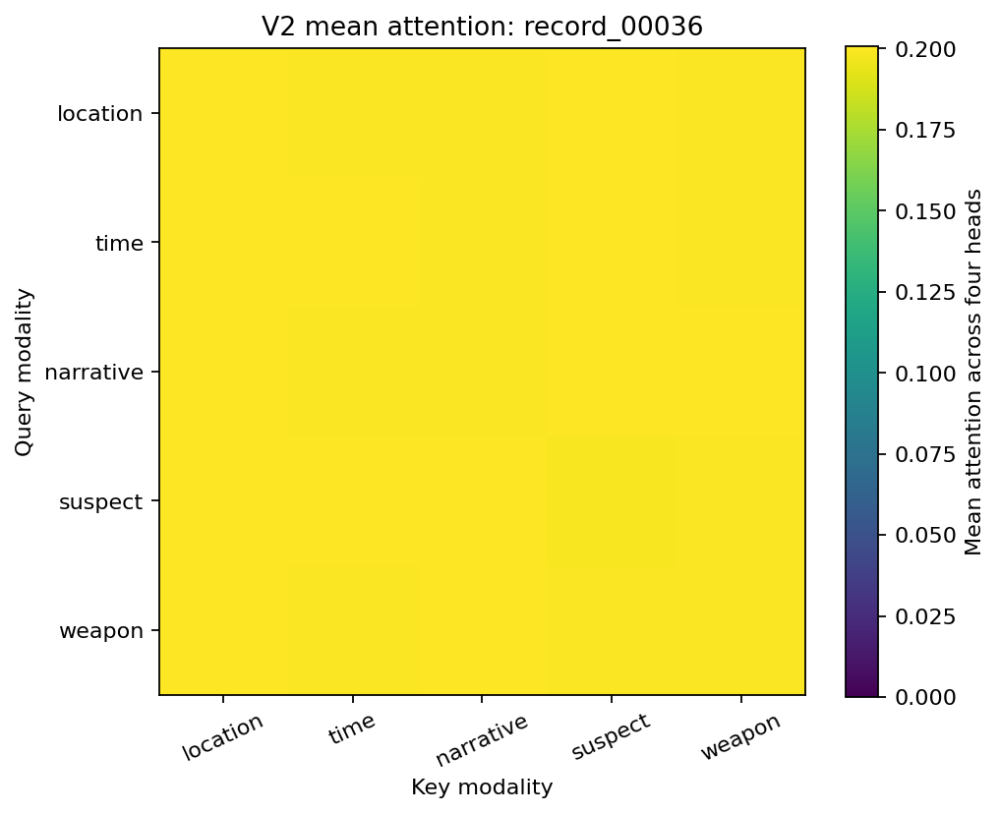

# Reference results

These results were regenerated from the public package using `configs/demo.json`: seed 42, CPU, one thread, Python 3.12.14 and PyTorch 2.6.0+cpu. Machine-readable evidence is in [summary.json](../examples/reference_run/summary.json), with the [effective configuration](../examples/reference_run/config.json) alongside it.

## Selected checkpoints

| Model | Parameters | Selected epoch | Epochs run | Validation pattern-macro NDCG@30 | Test pattern-macro NDCG@30 |
| --- | ---: | ---: | ---: | ---: | ---: |
| V1 global gates | 1,025,413 | 9 | 14 | 1.0000 | 1.0000 |
| V1.1 per-record quality gates | 1,025,418 | 9 | 14 | 1.0000 | 1.0000 |
| V2 self-attention | 1,158,538 | 2 | 7 | 1.0000 | 1.0000 |
| Mask-only control | — | — | — | 0.5421 | 0.7938 |

The mask-only control was evaluated directly and has no trained checkpoint. Its test value is a new public-run diagnostic; the source notebook displayed the mask control on validation only.

All three trained models rank related records first on this easy generated cohort. The saturated metrics cannot identify a better architecture, and the number of selected epochs is not a compute-normalized performance comparison.

Loss varies between epochs because the sampler selects different pattern members. A lower training loss in one variant does not establish better generalization. The selected checkpoint can precede the last executed epoch because training continues until early stopping.

## Diagnostic evidence

The quality-aware gates vary by record and remain zero for missing content. The learned time and subject-attribute quality slopes are negative in this run. Gate magnitude therefore should not be read as a calibrated assessment of data reliability.

V2's illustrated attention matrix is close to uniform across the five available tokens. This does not support a strong claim of selective modality interaction. The model can still learn through its adapters, residual paths, gates, and final MLP.

Inspect [gate parameters](../examples/reference_run/gate_parameters.csv), [gate statistics](../examples/reference_run/gate_statistics.csv), [attention values](../examples/reference_run/attention_v2.csv), and [ranked candidates](../examples/reference_run/rankings.csv) to see the underlying numbers.

## What was verified

The 37-test suite covers synthetic data generation and alignment, split separation, sampler coverage and odd-tail behavior, masked loss values and gradients, missing-modality behavior in all three encoders, hand-computed retrieval metrics, tie handling, and repeated training/checkpoint selection.

The public package was also compared with an independent replay of the source notebook in the same environment. Synthetic arrays, default sampler batches, model initial states and embeddings, loss gradients, complete training histories, selected epochs, and selected model tensors matched. The source comparison is a one-time extraction check; it is not part of public CI because the original notebooks are not distributed here.

The clean notebook was executed from a fresh kernel to produce the results notebook. The command-line experiment also completed independently. These are local checks; the GitHub Actions workflow has not run until the repository is published and hosted CI reports its own status.

## Interpretation limits

There are 12 validation records and seven eligible test records. Self exclusion leaves 11 and six candidates respectively, so @30 is clipped to these gallery sizes. Recall@30 is necessarily perfect, including for the mask-only control. NDCG still distinguishes ordering.

This is a single-seed demonstration with synthetic shared-latent structure, not an empirical benchmark for real-world retrieval. See [methodology](methodology.md) for the control's tie-breaking limitation, metric conventions, and experiments needed for a stronger comparison.
